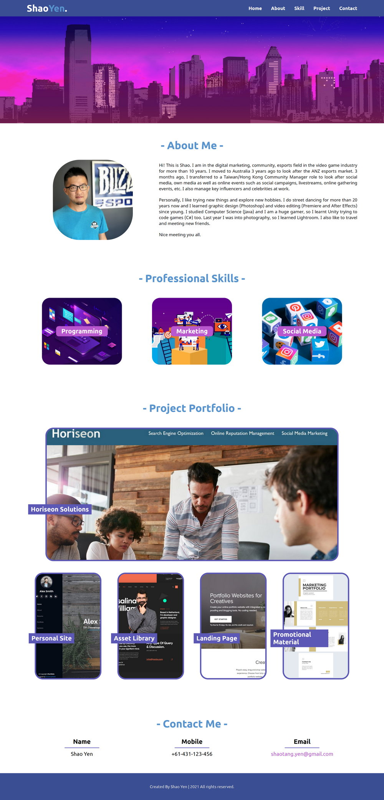
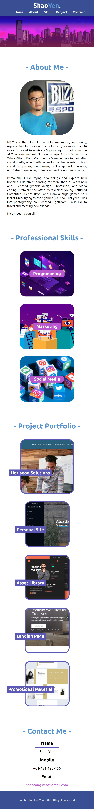

# Shao Yen's Portfolio Website

This site includes a navigation bar, banner section, About Me section, Skill section, Project section, Contact section.

## The Navigation Bar

Links in navigation bar trigger the UI scrolls down to its respective sections.

## The About Me section

In the About Me section, there are two divisions (left and right) and they change the warping diection when it's viewed on a smaller size of a screen.

## The Skill/Project sections

There are three/four divisions in the Skill/Project sections. When you mouse over skill or project images, there's a hover animation that tells you what you are focus on. The skills images are not clickable so the mouse stays an arrow. The Project images can link to an external website URL so the mouse changes to a clickable icon, image enlarge as well.

When you resize the page or view the site on different screens or sizes, the responsive layout adapts.

## The Contact Me sections

There are three divisions in the Contact Me section. Email is also linkable.

When you resize the page or view the site on different screens or sizes, the responsive layout adapts.

## The Footer sections

Adding a footer so it looks more like a real website.

## Link to the website

[Click here to open the site](https://shaotangyen.github.io/Shao-Yen-Portfolio-Website/)

## Screenshots

Desktop screenshot:

Mobile screenshot:

---

Created by Shao Yen @ 2021